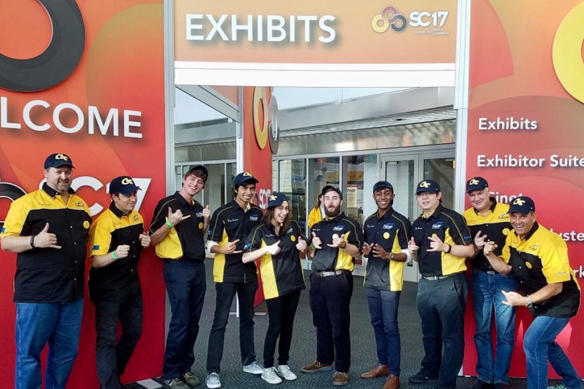

# Team Phoenix - Georgia Tech's Student Cluster Competition team and VIP Class

    

**Note:** Please see the Github Pages version of this site [here](https://gt-chipc.github.io/gt-student-cluster-competition/).

Georgia Tech's [Partnership for an Advanced Computing Environment (PACE)](https://pace.gatech.edu) and Georgia Tech's [Center for High-Performance Computing (CHIPC)](http://chipc.gatech.edu/) have collaborated to run a new [Vertically Integrated Projects (VIP)](https://vip.gatech.edu/) class called "Team Phoenix" to support the efforts of our undergraduate [Student Cluster Competition (SCC)](https://studentclustercompetition.us/) team. Enrolled students learn about the ins and outs of high performance computing and supercomputing cluster hardware, software, and applications. 

Team leads and co-instructors, Rich Vuduc (CSE, CHiPC director), Aaron Jezgahni (PACE), Will Powell (CSE), Jeffrey Young (SCS), and Vijay Thakkar (CSE graduate mentor) 
have led students through discussions of challenging topics like application optimization, cluster storage, and networking configurations. Team Phoenix students have 
also been able to hone their skills in CUDA programming and have tested running the standard Top 500 benchmark, Linpack, on the PACE instructional cluster, PACE-ICE. 
These undergrads have also benefited from PACE's [Linux 101](https://pace.gatech.edu/linux-101) and [102](https://pace.gatech.edu/linux-102) classes, which have given 
them a head start in using PACE cluster resources including the [Phoenix cluster](http://docs.pace.gatech.edu/phoenix_cluster/gettingstarted_phnx/), the #277 system on 2020's Top500 list.

Please check out the following pages for more information on recent competition teams:
* [Supercomputing SCC 2021 (Virtual)](docs/supercomputing-scc-2021.md)
* [Supercomputing SCC 2020 (Virtual)](docs/supercomputing-scc-2020.md) - 3rd place overall!
* [Supercomputing SCC 2017](docs/supercomputing-scc-2017.md)
