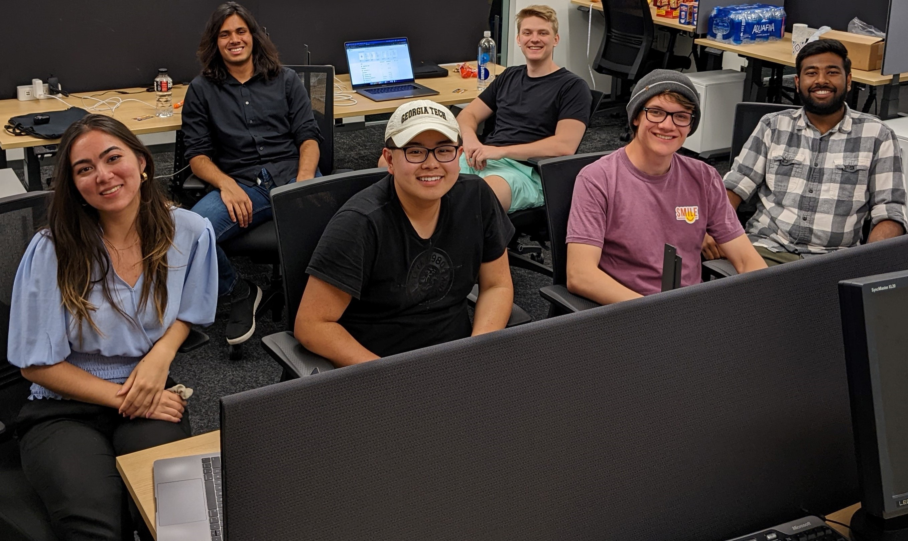

# Team Phoenix at International Supercomputing Conference 2022

Georgia Tech will be competing at the 2022 International Supercomputing Student Cluster Competition as a virtual team.

    

Our competition team includes the following members:
*	Jackie Chen
*	Ryan Elliott
*	Aditya Kaushik
*	Sahit Kavukuntla
*	Evan Montoya
*	Marissa Sorkin

Advisors
*	Aman Jain - undergraduate mentor
*	Aaron Jezghani - PACE
*	William Powell - CSE
*	Richard Vuduc - CSE
*	Jeffrey Young - SCS

Please check back for more details on the competition and how our team did!
