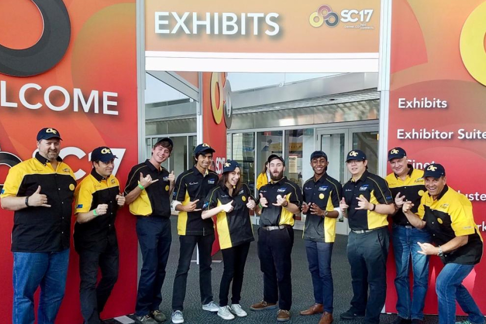

# Georgia Tech SCC at Supercomputing 2017 - "Team Swarm"

    

Georgia Tech's "Team Swarm" first competed at the Supercomputing Student Cluster Competition in 2017 with a novel Power8 system with P100 GPUs.

## Vendor Sponsors
* IBM
* Avnet
* Flagship

## Team Composition

### Team Members
* Petros Eskinder
* Nicholas Fahrenkrog
* Dezhi Fang
* David Meyer
* Jessica Rosenfield
* Alok Tripathy

### Advisors
* Oded Green - CSE
* Chirag Jain - CSE graduate student advisor
* William Powell - CSE

## Team Swarm Documents
* [Team Swarm poster](files/2017/gt_scc_supercomputing17_poster.pdf)
* [Additional Team Swarm files](https://github.com/scc-gatech/paper-boys)
