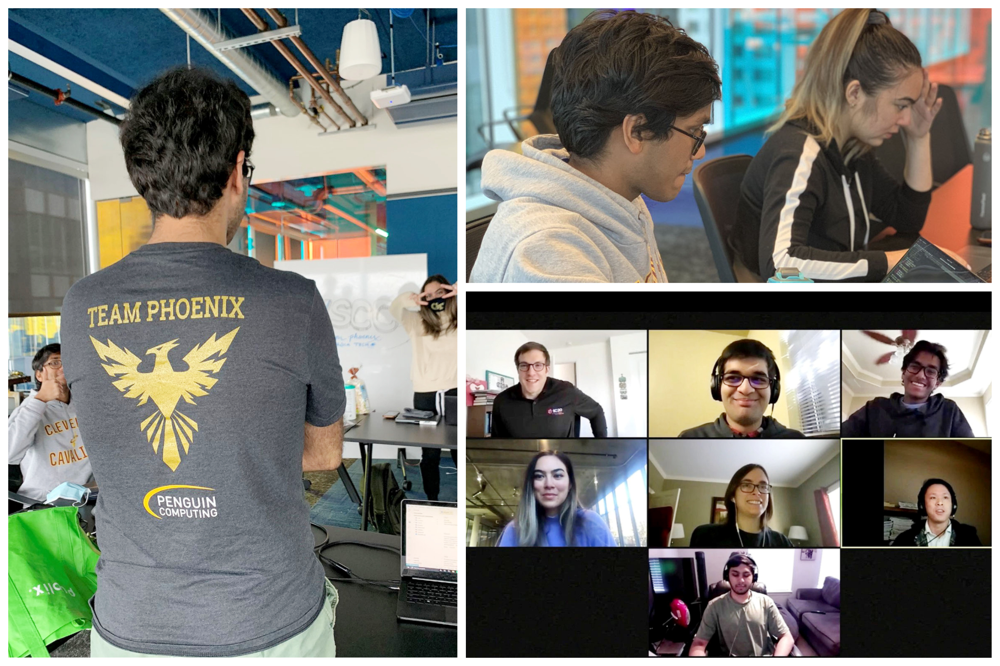

# Team Phoenix at Supercomputing 2021

2020 saw the restart of the GT SCC team as well as the introduction of "Team Phoenix" as our competition team. Due to the COVID-19 pandemic, we competed in a virtual fashion using the Azure cloud. Team Phoenix ended up placing 3rd out of 19 teams! 

Check out the [VSCC 2020 Poster](files/gt_vscc_supercomputing20_poster.pdf) for an overview of the team and our preparation strategy.

    

## Vendor Sponsors
* Penguin Computing (thank you for the awesome shirts!)
* Intel
* NVIDIA

## Team Composition

### Team Members
* Sudanshu Agarwal
* Albert Chen
* Ali Kazmi
* Aman Jain
* Nicole Prindle
* Marissa Sorkin

### Advisors
* Vijay Thakkar - graduate mentor
* Aaron Jezghani - PACE
* William Powell - CSE
* Richard Vuduc - CSE
* Jeffrey Young - SCS
* Special thanks to Kevin Manalo (PACE) for his help in educating us on containers!

## YouTube Videos about our Virtual SCC Experience (produced by Kristen Perez)

* [Wrap-up](https://www.youtube.com/watch?v=nTdpKZD9vZM)
* [Day 3](https://www.youtube.com/watch?v=N-vqdtRuQlo)
* [Day 2](https://www.youtube.com/watch?v=YXsu6btPZeM)
* [VSCC Kickoff](https://www.youtube.com/watch?v=iHjCJPsr8hI)
* [Team Phoenix Logo](https://www.youtube.com/watch?v=fL1EKehV1I8)
