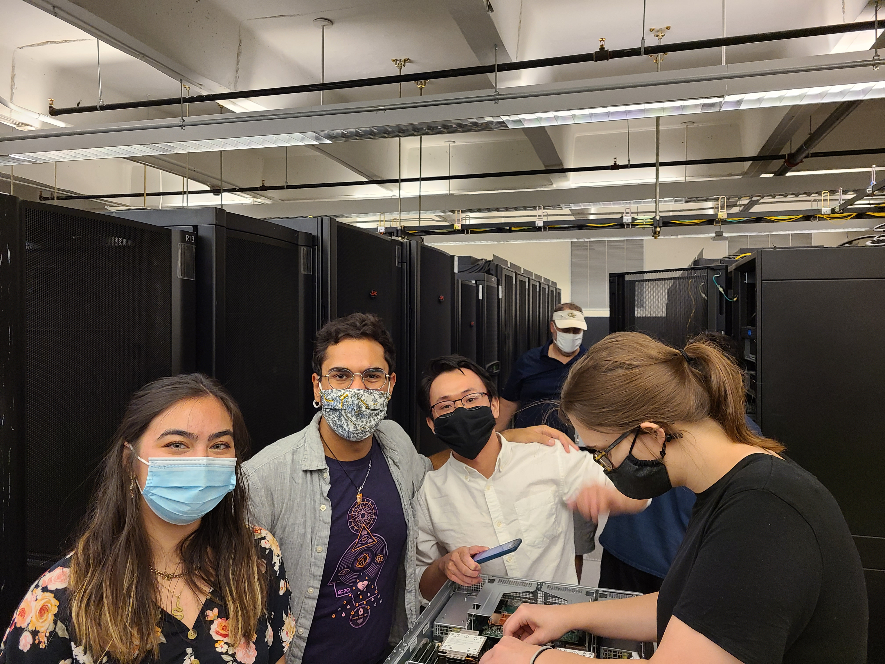

# Team Phoenix at Supercomputing 2021

Georgia Tech fielded a team at the 2021 Supercomputing Conference in the [Virtual Student Cluster Competition](https://sc21.supercomputing.org/program/studentssc/student-cluster-competition/), an event hosted on Azure and Oracle cloud platforms. Please see this article (pg. 5) in the [PACE newsletter](https://pace.gatech.edu/sites/default/files/pace-newsletter-fall2021.pdf) about the GT SC21 SCC team!

    

Our competition team included the following members:
*	Marissa Sorkin
*	Nicole Prindle
*	Evan Montoya
*	Ryan Elliott
*	Albert Chen
*	Aman Jain

Advisors
*	Vijay Thakkar - graduate mentor
*	Aaron Jezghani - PACE
*	William Powell - CSE
*	Richard Vuduc - CSE
*	Jeffrey Young - SCS
